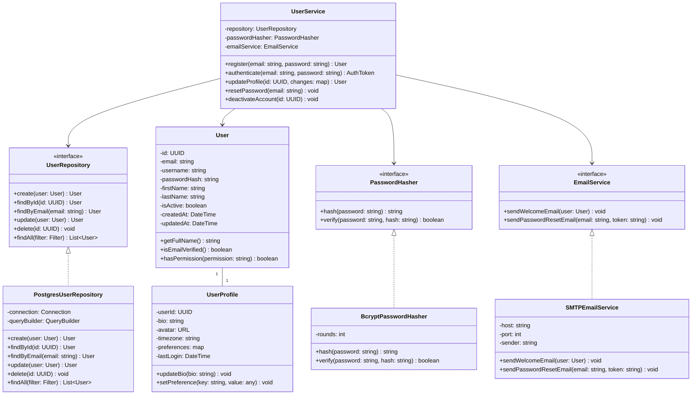
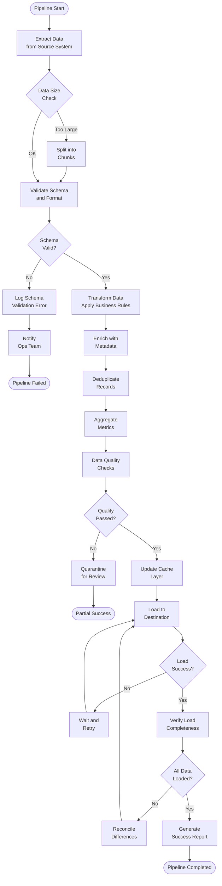
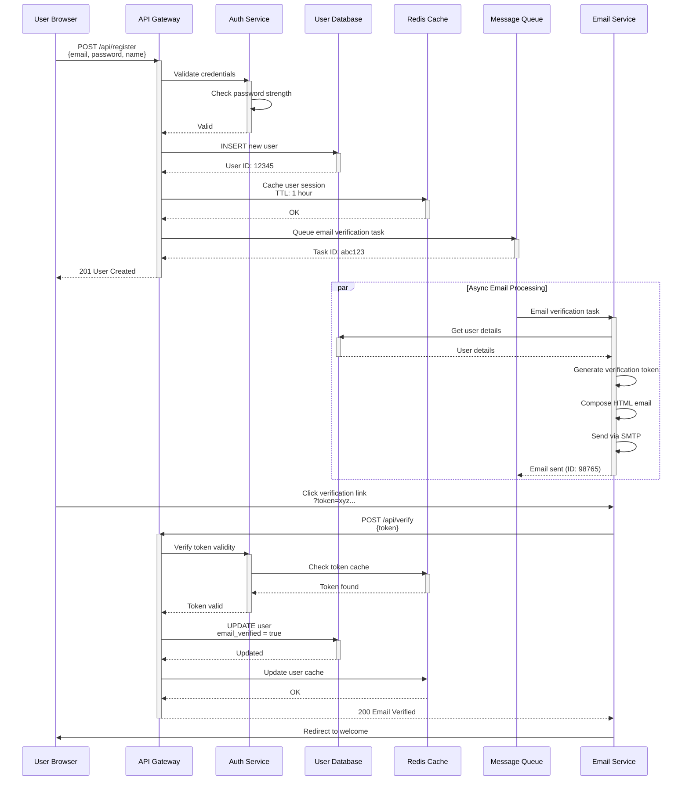
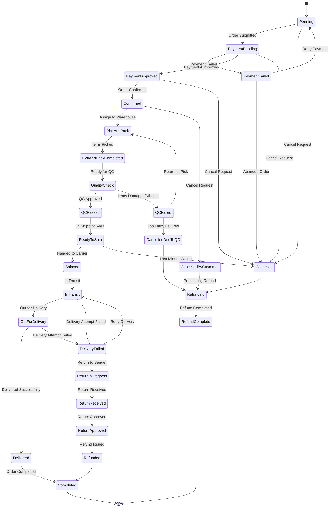
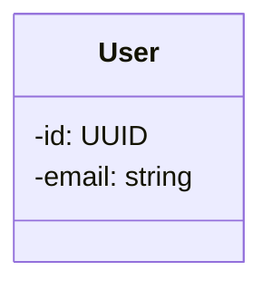

# Mermaid Diagram Examples

Copy-paste ready Mermaid diagram examples for common architecture scenarios. All examples are production-ready and can be used directly in your documentation.

## Class Diagram: User Service Architecture

**Use Case:** Service-oriented architecture with repositories and domain models

**Copy this code into a markdown code block with ```mermaid``` fence:**



**Description:** This diagram shows a user service with dependency injection, repository pattern for data access, and separate concerns for password hashing and email notifications. Each component has a single responsibility and depends on abstractions.

---

## Flowchart: Data Processing Workflow

**Use Case:** ETL (Extract, Transform, Load) pipeline with error handling

**Copy this code into a markdown code block with ```mermaid``` fence:**



**Description:** This flowchart shows a production-grade data pipeline with validation, error handling, retries, and quality checks. It handles both success and failure scenarios with appropriate notifications.

---

## Sequence Diagram: User Registration and Email Verification

**Use Case:** Multi-service interaction with asynchronous operations

**Copy this code into a markdown code block with ```mermaid``` fence:**



**Description:** This sequence diagram shows a user registration flow with async email processing. It demonstrates proper separation of concerns with authentication, database, caching, and messaging services.

---

## Entity Relationship Diagram: E-Commerce System

**Use Case:** Complex data model with multiple entities and relationships

**Copy this code into a markdown code block with ```mermaid``` fence:**

```mermaid
erDiagram
    CUSTOMER ||--o{ ORDER : places
    CUSTOMER ||--o{ REVIEW : writes
    CUSTOMER ||--o{ WISHLIST : maintains
    ORDER ||--|{ ORDER_ITEM : contains
    ORDER_ITEM }o--|| PRODUCT : includes
    PRODUCT ||--o{ REVIEW : receives
    PRODUCT ||--o{ INVENTORY : tracked_by
    PRODUCT }o--|| CATEGORY : belongs_to
    PRODUCT ||--o{ PRODUCT_IMAGE : has
    PRODUCT }o--|| SUPPLIER : supplied_by
    ORDER ||--o{ SHIPMENT : tracked_by
    SHIPMENT ||--o{ SHIPMENT_EVENT : records
    ORDER ||--o{ PAYMENT : processes
    CUSTOMER ||--o{ ADDRESS : has
    WISHLIST }o--|| PRODUCT : contains
    SUPPLIER ||--o{ SUPPLIER_CONTACT : has
    
    CUSTOMER {
        int customer_id PK
        string email UK
        string password_hash
        string first_name
        string last_name
        string phone
        text preferences
        datetime created_at
        datetime updated_at
    }
    
    ADDRESS {
        int address_id PK
        int customer_id FK
        string type
        string street_line1
        string street_line2
        string city
        string state
        string postal_code
        string country
        boolean is_default
    }
    
    PRODUCT {
        int product_id PK
        string sku UK
        string name
        text description
        int category_id FK
        int supplier_id FK
        decimal price
        decimal cost
        int rating
        int total_reviews
        string status
        datetime created_at
    }
    
    CATEGORY {
        int category_id PK
        string name UK
        text description
        int parent_category_id FK
    }
    
    SUPPLIER {
        int supplier_id PK
        string name UK
        string website
        text contact_info
        string payment_terms
        datetime created_at
    }
    
    SUPPLIER_CONTACT {
        int contact_id PK
        int supplier_id FK
        string name
        string email
        string phone
        string role
    }
    
    INVENTORY {
        int inventory_id PK
        int product_id FK UK
        int quantity_on_hand
        int quantity_reserved
        int quantity_reorder
        string warehouse_location
        datetime last_counted
    }
    
    PRODUCT_IMAGE {
        int image_id PK
        int product_id FK
        string url
        string alt_text
        int display_order
        boolean is_primary
    }
    
    ORDER {
        int order_id PK
        int customer_id FK
        decimal subtotal
        decimal tax
        decimal shipping_cost
        decimal total
        string status
        string currency
        datetime order_date
        datetime expected_delivery
    }
    
    ORDER_ITEM {
        int order_item_id PK
        int order_id FK
        int product_id FK
        int quantity
        decimal unit_price
        decimal discount
        decimal line_total
    }
    
    PAYMENT {
        int payment_id PK
        int order_id FK UK
        string method
        string status
        decimal amount
        string transaction_id
        string currency
        datetime processed_at
    }
    
    SHIPMENT {
        int shipment_id PK
        int order_id FK
        string carrier
        string tracking_number
        string status
        datetime shipped_at
        datetime estimated_delivery
        datetime delivered_at
    }
    
    SHIPMENT_EVENT {
        int event_id PK
        int shipment_id FK
        string status
        text message
        datetime event_time
        string location
    }
    
    REVIEW {
        int review_id PK
        int product_id FK
        int customer_id FK
        int rating
        string title
        text content
        int helpful_votes
        datetime created_at
        boolean verified_purchase
    }
    
    WISHLIST {
        int wishlist_id PK
        int customer_id FK
        string name
        text description
        boolean is_public
        datetime created_at
    }
```

**Description:** This ERD shows a complete e-commerce system with customers, products, orders, payments, and shipments. It demonstrates proper foreign key relationships, cardinality, and realistic attributes.

---

## State Diagram: Order Fulfillment Process

**Use Case:** Complex workflow with multiple states and transitions

**Copy this code into a markdown code block with ```mermaid``` fence:**



**Description:** This state diagram models a realistic order fulfillment workflow with payment processing, quality checks, shipping, delivery attempts, and return flows. It shows how orders can transition through various states and handle exceptions.

---

## Integration Example: Adding Diagrams to Architecture Template

To integrate these diagrams into your architecture documentation, use this template structure:

```markdown
# System Architecture

## Overview

Brief description of the system.

## Component Architecture

How components interact:

\`\`\`mermaid
[Insert class diagram or sequence diagram here]
\`\`\`

## Data Model

Database and entity relationships:

\`\`\`mermaid
[Insert ERD here]
\`\`\`

## Data Processing Workflow

How data flows through the system:

\`\`\`mermaid
[Insert flowchart here]
\`\`\`

## User Interaction Flow

How users interact with the system:

\`\`\`mermaid
[Insert sequence diagram here]
\`\`\`

## System States

State transitions and lifecycles:

\`\`\`mermaid
[Insert state diagram here]
\`\`\`
```

---

## Tips for Using These Examples

1. **Copy Exactly** – Copy the entire mermaid code block to ensure syntax is correct
2. **Customize Text** – Update names, attributes, and relationships to match your system
3. **Add Comments** – Mermaid supports comments with `%%` for documentation
4. **Test Rendering** – Verify in your documentation platform (GitHub, GitLab, etc.)
5. **Keep DRY** – Reuse diagram patterns across your documentation
6. **Version Diagrams** – Track diagram changes with your architecture updates

---

## Advanced Techniques

### Adding Comments to Diagrams



### Styling Diagrams

You can customize appearance in Mermaid Live Editor or via configuration. See the [Mermaid Diagrams Reference](./mermaid-diagrams.md) for advanced styling options.

### Exporting Diagrams

- **PNG/SVG** – Use Mermaid Live Editor or CLI
- **Markdown** – Copy the diagram code into your files
- **Draw.io** – Some diagram types can be exported to draw.io
