# Mermaid Diagrams Guide

Mermaid is a JavaScript-based diagramming and charting tool that uses a simple, markdown-inspired syntax to create and modify diagrams dynamically. This guide provides comprehensive examples of using Mermaid to document architecture, design patterns, and data flow.

## Introduction to Mermaid

Mermaid renders markdown-like text definitions to dynamically create diagrams. It's perfect for architecture documentation because:

- **Version Control Friendly** – Diagrams are stored as text, making them easy to track in Git
- **Documentation-Integrated** – Renders directly in Markdown files and documentation
- **Quick Iteration** – Easy to update and modify without external tools
- **Consistent Styling** – Automatic diagram formatting and layout

## Class Diagrams

Class diagrams show the static structure of a system, including classes, interfaces, and their relationships.

### Basic Class Diagram Syntax

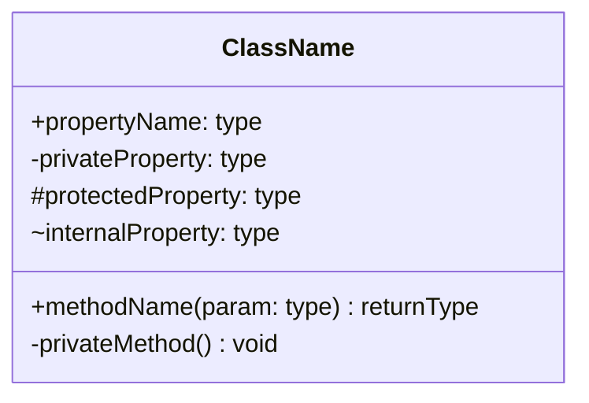

### Relationships in Class Diagrams

**Inheritance (Solid line with hollow arrow)**
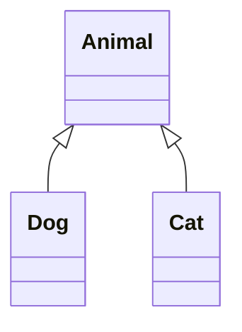

**Interface Implementation (Dashed line with hollow arrow)**
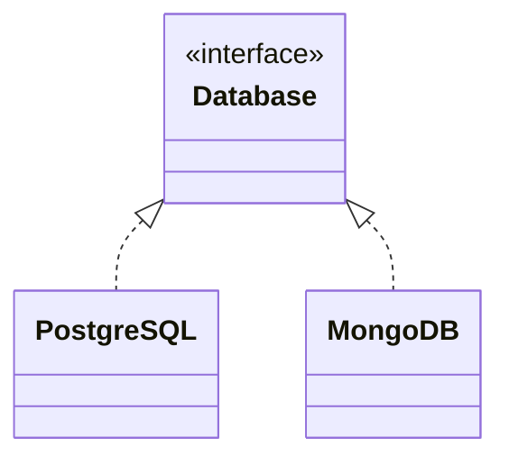

**Association (Solid line with arrow)**
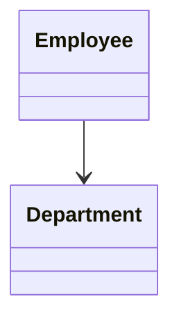

**Aggregation (Solid line with hollow diamond)**
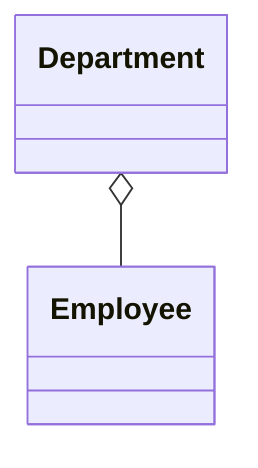

**Composition (Solid line with filled diamond)**
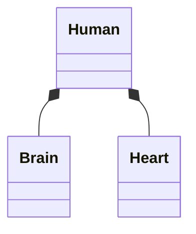

### Complete Class Diagram Example

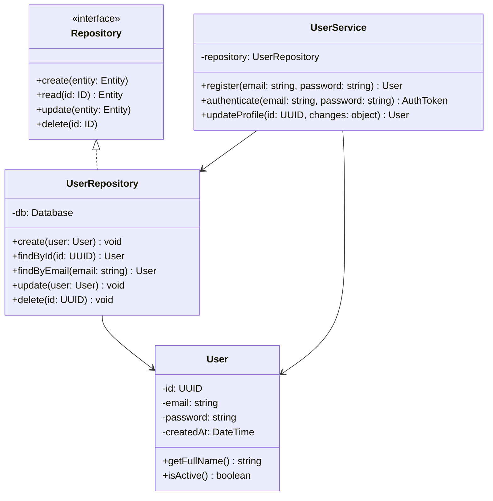

### Class Diagram Multiplicity

Multiplicity indicates how many instances can participate in a relationship:

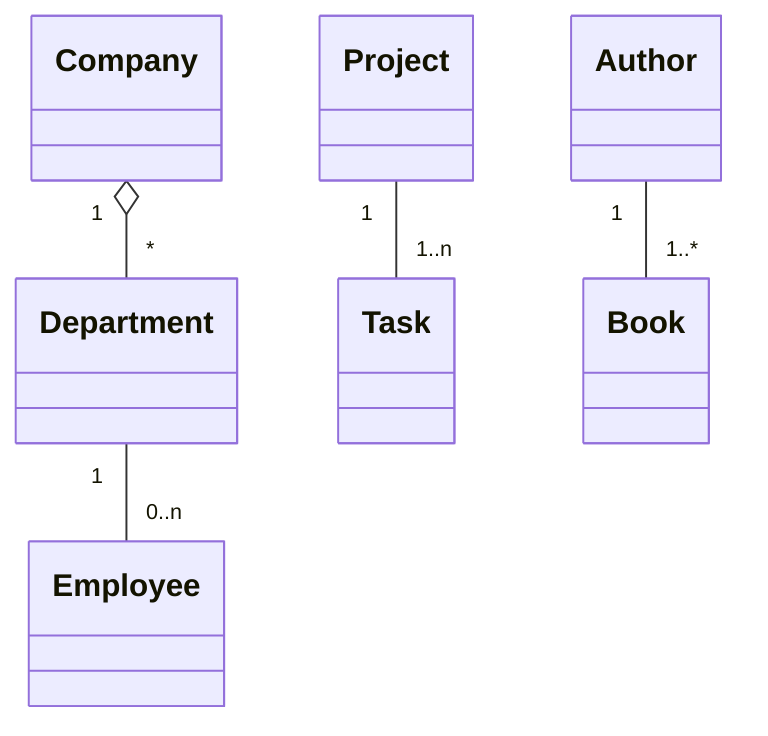

**Multiplicity notation:**
- `1` - exactly one
- `0..1` - zero or one
- `*` or `0..*` - zero or more
- `1..*` - one or more
- `n` - exactly n

## Flowcharts

Flowcharts describe processes, algorithms, and decision trees using a sequence of steps and decision points.

### Basic Flowchart Syntax

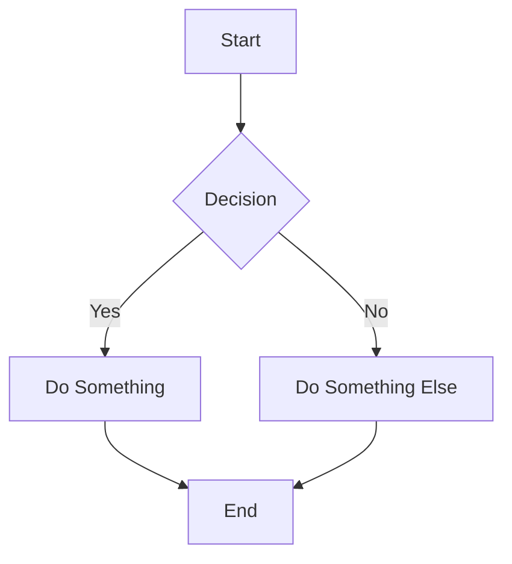

### Node Types

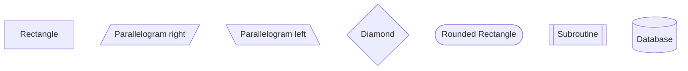

### Direction Options

- `TD` - Top Down
- `BT` - Bottom Top
- `LR` - Left Right
- `RL` - Right Left

### Flowchart Example: Data Processing Pipeline

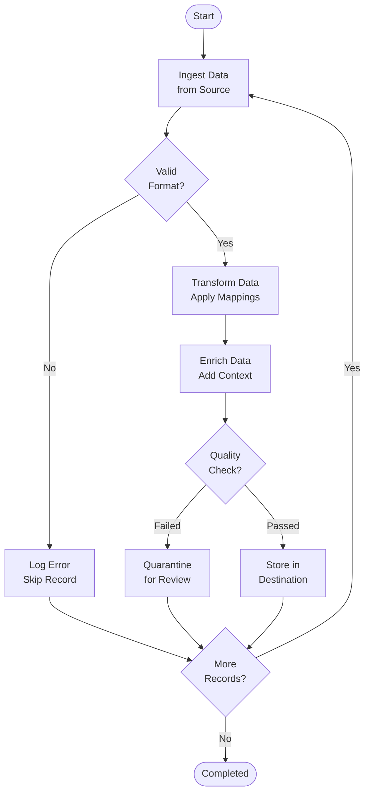

### Flowchart Example: System Decision Flow

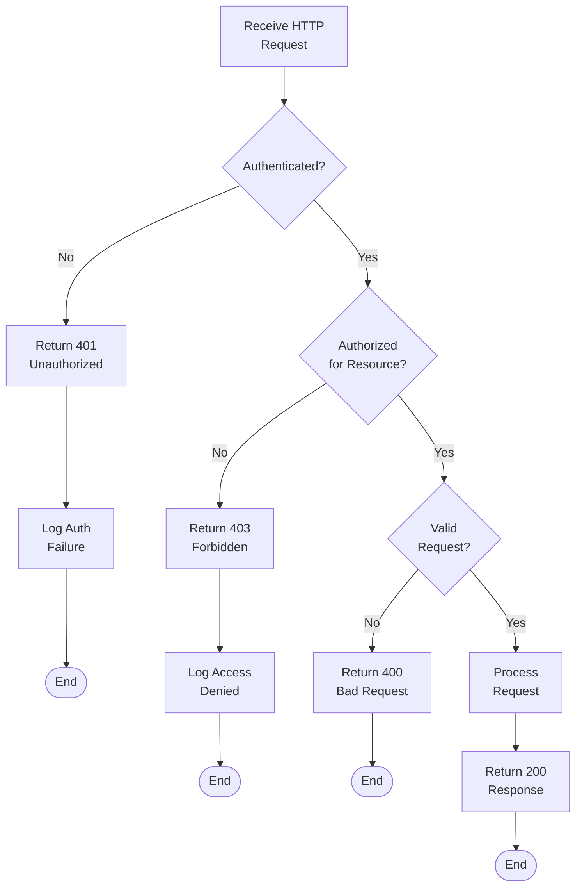

## Sequence Diagrams

Sequence diagrams show how components interact with each other over time, displaying the order and timing of message exchanges.

### Basic Sequence Diagram Syntax

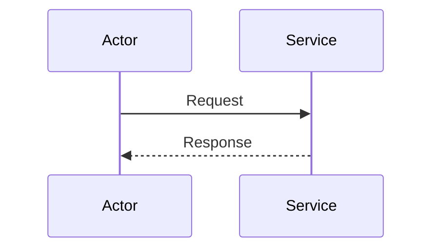

### Interaction Types

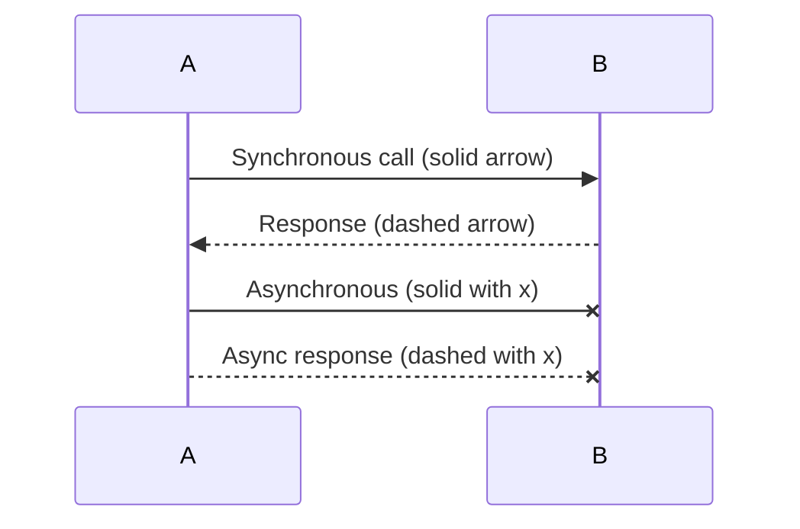

### Activation Boxes

Activation boxes show when a component is active (processing):

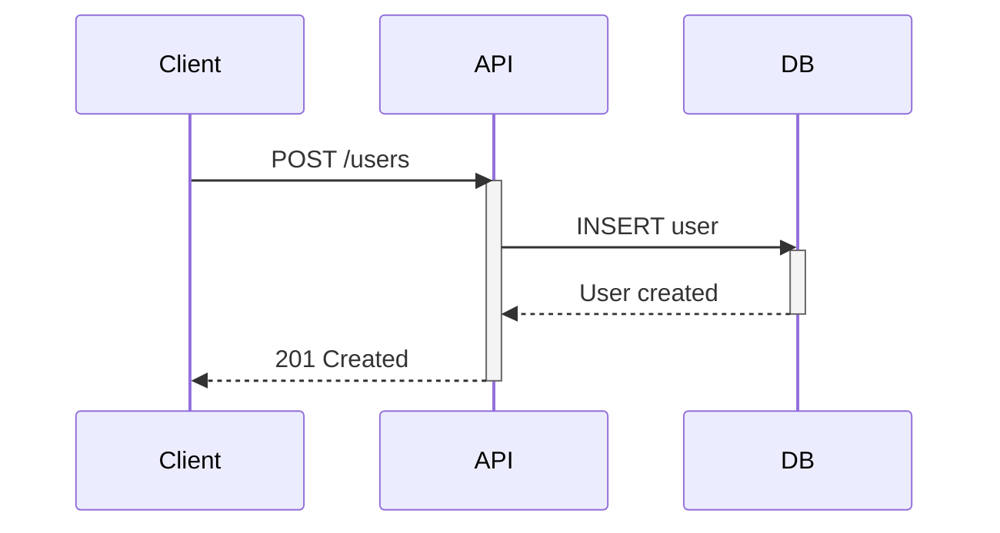

### Sequence Diagram Example: User Registration

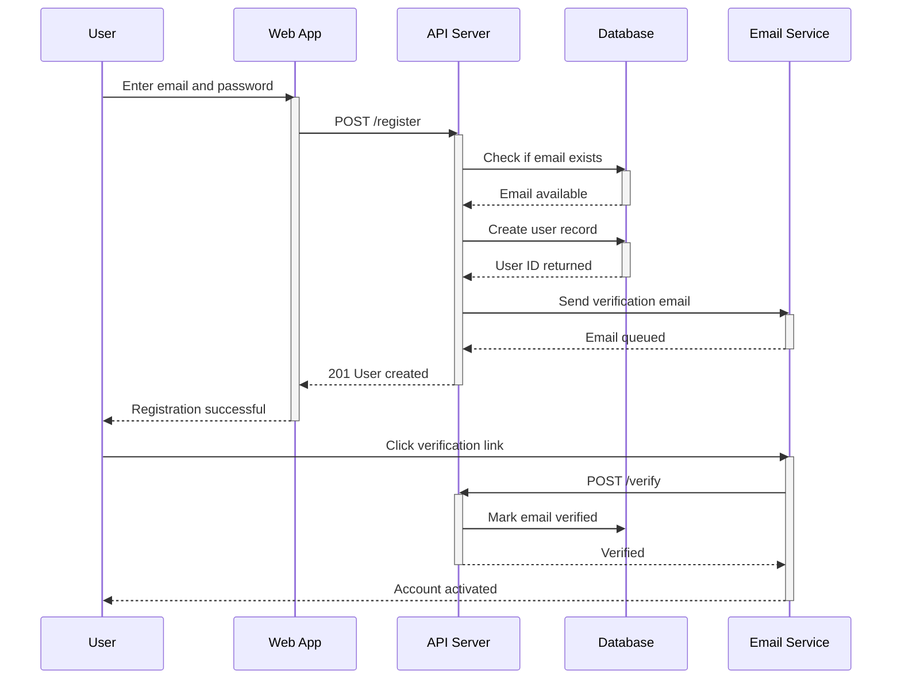

### Sequence Diagram Example: API Request with Caching

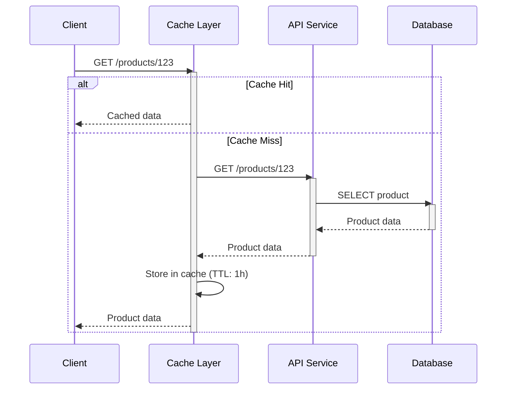

## Entity Relationship Diagrams (ERD)

Entity-relationship diagrams show how entities (tables) relate to each other in a data model.

### Basic ERD Syntax

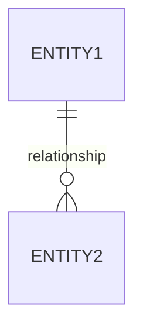

### Relationship Types

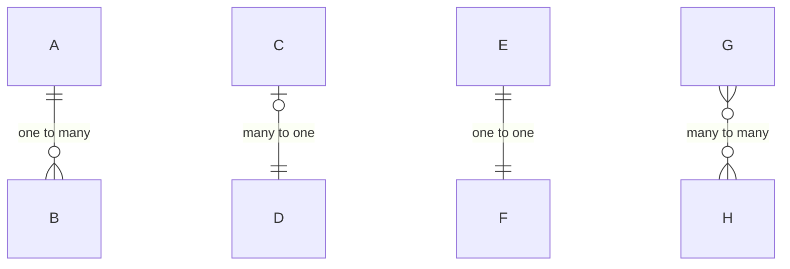

**Relationship notation:**
- `||` - exactly one
- `o{` - zero or more
- `}{` - one or more
- `o|` - zero or one

### Complete ERD Example

```mermaid
erDiagram
    USER ||--o{ ORDER : places
    USER ||--o{ REVIEW : writes
    ORDER ||--|{ PRODUCT : contains
    PRODUCT ||--o{ CATEGORY : belongs
    PRODUCT ||--o{ REVIEW : receives
    ORDER ||--o{ PAYMENT : processes
    USER ||--o{ ADDRESS : has
    
    USER {
        int user_id PK
        string email UK
        string password_hash
        string first_name
        string last_name
        datetime created_at
        datetime updated_at
    }
    
    PRODUCT {
        int product_id PK
        string name UK
        text description
        decimal price
        int stock_quantity
        int category_id FK
    }
    
    CATEGORY {
        int category_id PK
        string name UK
        text description
    }
    
    ORDER {
        int order_id PK
        int user_id FK
        decimal total_amount
        string status
        datetime created_at
    }
    
    PAYMENT {
        int payment_id PK
        int order_id FK UK
        string method
        decimal amount
        string status
        datetime processed_at
    }
    
    REVIEW {
        int review_id PK
        int product_id FK
        int user_id FK
        int rating
        text comment
        datetime created_at
    }
    
    ADDRESS {
        int address_id PK
        int user_id FK
        string street
        string city
        string state
        string postal_code
        string country
    }
```

## State Diagrams

State diagrams model the states and transitions of a system or component.

### Basic State Diagram Syntax

```mermaid
stateDiagram-v2
    [*] --> State1
    State1 --> State2: Condition
    State2 --> [*]
```

### State Diagram Example: Order Processing

```mermaid
stateDiagram-v2
    [*] --> Pending
    
    Pending --> Confirmed: Confirm Order
    Pending --> Cancelled: Cancel
    
    Confirmed --> Processing: Start Processing
    Confirmed --> Cancelled: Cancel
    
    Processing --> Packaged: Package Items
    Processing --> Cancelled: Cancel
    
    Packaged --> Shipped: Ship Order
    Packaged --> Cancelled: Cancel
    
    Shipped --> InTransit: In Transit
    
    InTransit --> Delivered: Delivery Confirmed
    InTransit --> Failed: Delivery Failed
    
    Failed --> Reshipped: Reship
    Reshipped --> InTransit
    
    Delivered --> [*]
    Cancelled --> [*]
```

### State Diagram Example: User Session

```mermaid
stateDiagram-v2
    [*] --> Unauthenticated
    
    Unauthenticated --> Authenticating: Login Attempt
    Authenticating --> Unauthenticated: Auth Failed
    Authenticating --> Authenticated: Auth Success
    
    Authenticated --> Active: User Activity
    Active --> Idle: No Activity (timeout > 5min)
    Idle --> Active: User Activity
    Idle --> SessionExpired: Timeout > 30min
    
    Active --> LoggingOut: Logout
    Authenticated --> LoggingOut: Logout
    
    LoggingOut --> Unauthenticated
    SessionExpired --> Unauthenticated
```

## Architecture Diagram Best Practices

### Do's

- Keep diagrams focused on a single concept or layer
- Use consistent naming conventions across all diagrams
- Include legends for symbols and patterns
- Document the purpose and scope of each diagram
- Update diagrams when architecture changes
- Use meaningful labels on relationships and arrows
- Group related entities or components
- Show data flow direction clearly

### Don'ts

- Mix multiple architecture levels in one diagram
- Use ambiguous relationship labels
- Create overly complex diagrams (split if needed)
- Forget to version diagrams with architecture
- Use unexplained abbreviations
- Create diagrams without describing their context
- Mix different diagram types without clear purpose
- Ignore performance implications in flowcharts

## Mermaid Rendering Locations

Mermaid diagrams render in these environments:

- **Markdown files** – GitHub, GitLab, Gitea, Notion, etc.
- **Code documentation** – Within JSDoc, Pydoc comments
- **Confluence** – Via Mermaid plugin
- **Obsidian** – Built-in support
- **VS Code** – Via Markdown preview or extensions
- **Online** – [Mermaid Live Editor](https://mermaid.live)

## Tools and Extensions

- **Mermaid CLI** – Generate diagrams from command line
- **VS Code Extension** – Mermaid extension for syntax highlighting
- **Draw.io Integration** – Export from Mermaid to draw.io
- **Mermaid Preview** – Real-time preview in VS Code

## Resources

- [Official Mermaid Documentation](https://mermaid.js.org)
- [Mermaid Live Editor](https://mermaid.live)
- [Mermaid GitHub Repository](https://github.com/mermaid-js/mermaid)
